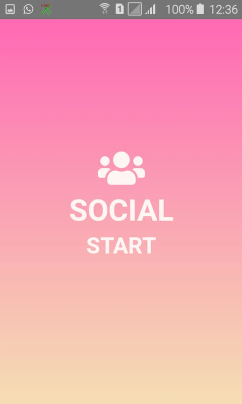
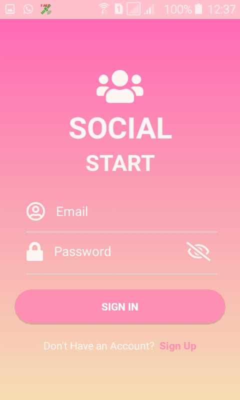
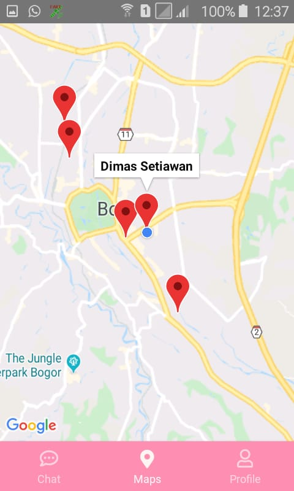

# Social Start : Chat And Realtime Tracking Map

---
## Table Of Contents

- [Intro](#Intro)
- [Feature](#Feature)
- [Requirments](#Requirments)
- [Installation](#Installation)
  - [Clone Repo](#Clone-Repo)
  - [Install Depedencies](#Install-Depedencies)
  - [Run on android device](#Run-on-android-device)
  - [Run on ios device](#Run-on-ios-device)
  - [Build For Production](#Build-For-Production)
- [Dependencies](#Dependencies)
- [Interface](#Interface)
- [License and Support](#License-and-Support)

---

### Intro

---
### Features

- [x] Simple UI chat design
- [x] Get list of registered users
- [x] Chatting feature of course
- [x] You can track where is all friend location
- [x] Update Status
- [x] Edit your photo profile

---


### Requirments

- [Nodejs](https://nodejs.org/en/) v10 LTS version
- [Android SDK](https://developer.android.com/studio#downloads)
- [Npm](https://www.npmjs.com/get-npm) package / [Yarn](https://yarnpkg.com/lang/en/docs/install/#mac-stable) package

---

### Installation

##### 1. Clone Repo

clone the repository

```sh
$ git clone https://github.com/FakhrurR/maps-chat-realtime.git
$ cd map-chat-realtime
```

##### Install Depedencies

Install requirement depedencies

```sh
$ yarn install
```

##### Run on android device

```sh
$ react-native run android
```

##### Run on ios device

```sh
$ react-native run ios
```

##### Build For Production

build for production ready, and host ready

```sh
$ cd android && ./gradlew --assembleRelease
```

---

### Dependencies

List of depedencies using in this project

| Plugin                                                                                              | Description                                                                                                     |
| --------------------------------------------------------------------------------------------------- | --------------------------------------------------------------------------------------------------------------- |
| [React Native](https://facebook.github.io/react-native/)                                            | Mobile Apps                                                                                                          |
| [React Native Firebase](https://rnfirebase.io/)                                                     | A service provided by Google (this app use realtime database)                                                   |
| [Firebase](https://www.npmjs.com/package/firebase)                                                  | provides the tools and infrastructure you need to develop, grow, and earn money from your app.                  |
| [React Native Maps](https://github.com/react-native-community/react-native-maps)                    | A package to display mapview from Google Maps API.                                                              |
| [React Navigation](https://reactnavigation.org/)                                                    | Routing and navigation for your React Native apps                                                               |
| [Image Picker](https://github.com/react-native-community/react-native-image-picker)                 | A package that allows you to use native UI to select media from the device library or directly from the camera. |
| [RN Material Bottom Navigation](https://github.com/timomeh/react-native-material-bottom-navigation) | a beautiful, customizable and easy-to-use material design bottom navigation for react-native                    |

# Interface

 &nbsp;&nbsp;&nbsp;
 &nbsp;&nbsp;&nbsp;
 &nbsp;&nbsp;&nbsp;
 &nbsp;&nbsp;&nbsp;
 &nbsp;&nbsp;&nbsp;
 &nbsp;&nbsp;&nbsp;
 


## License and Support

For Bug report, please contact me
[FakhrurR](https://github.com/FakhrurR 'FakhrurR')

MIT

Copyright © 2019 by Fakhrur Rijal
